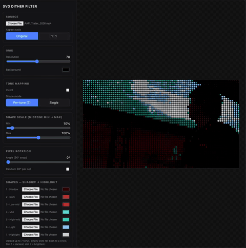

# SVG Dither Filter 2.3

A zero-dependency, single-file tool that turns an uploaded image or video into a
shape-based dither using built-in shapes or your own SVGs — then exports the
result as **print-ready PNG/vector-SVG artwork**.

No build step, no install. Open `index.html` in a browser and go.
The original v1 is kept as `index-v1.html` (also tagged `v1.0` in git).


## Demo



## Features

### Print engine (new in 2.2)

- **CMYK print mode** — the image is separated into four ink screens (cyan,
  magenta, yellow, black) at the classic angles (15°/75°/0°/45°), multiply-
  blended like real offset print, with authentic halftone rosettes. Channel
  toggles give instant duotone/tritone poster looks; any built-in shape can
  be the halftone dot. Exports to PNG **and** vector SVG (4 ink groups).
- **Blue-noise dithering** — a precomputed 32×32 void-and-cluster matrix for
  organic, clump-free grain (vs. the regular Bayer crosshatch).
- **Zoom & pan** — scroll to zoom (up to 12×, rendered at higher resolution so
  dots stay crisp), drag to pan, double-click to reset. Hold still to compare
  with the original.
- **Reposition the crop** — when a paper/1:1 format is active, drag the image
  directly on the canvas to choose which part of the photo stays in frame
  (double-click recentres). The offset carries through to every export.

### Artwork engine (new in 2.1)

- **Artwork export** — high-res PNG and **true vector SVG** (symbols + uses):
  infinitely scalable, ideal for print and pen plotters.
- **Paper sizes (A1–A4)** — pick *A staand* / *A liggend* as the canvas format
  (the photo is centre-cropped to the 1:√2 ratio) and export PNG at exact
  print resolution (A4–A1 at 150/300 dpi, up to 9933 px). The SVG export gets
  real mm dimensions (`width="420mm"`), so it opens at true size in
  Illustrator/Inkscape. A guard warns when the canvas ratio doesn't match.
- **Real dithering algorithms** — Floyd–Steinberg error diffusion and ordered
  Bayer 4×4 / 8×8, on top of the original tone-bucket mapping.
- **Source colour mode** — every cell picks its colour from the image itself,
  with a saturation boost slider. Pointillism & mosaic looks in one click.
- **Flow rotation** — shapes align to the image contours (Sobel gradients), so
  strokes follow hair, waves, and brushwork. Try *Flow Lines* on Starry Night.
- **Tone curve** — brightness / contrast / gamma before tone mapping.
- **Grid types** — square, brick (offset), and hexagonal packing, plus a gap
  control and per-cell size/angle jitter.
- **Transparent background** — for PNG/SVG export over your own backdrop.
- **Drag & drop + paste (⌘V)** — and hold the mouse on the canvas to compare
  with the original.
- **Unsplash search** — search photos in the Source panel and load one with a
  click (CORS-clean, so all exports keep working). Shows attribution and fires
  the download ping per Unsplash guidelines. Same query again = next page.
  Put your Access Key in a local `unsplash-key.js` (gitignored):
  `window.UNSPLASH_KEY = '…'` — or paste it in the one-time prompt.
- **Shuffle** — one button that rolls a random-but-tasteful combination of
  palette, shapes, grid, and dithering. Great for discovery.

### Presets (new in 2.0, expanded in 2.1)

- **40 built-in looks in 5 categories** — *Print & druk* (Halftone, Newsprint,
  Riso, CMYK Poster, Duotone, Ben-Day Pop, Sunday Comics, Sepia Krant, Manga
  Screentone, Stippelgravure, Ink Hatch, Blueprint), *Kunst* (Pointillism,
  Flow Lines, Kusama Rood, Hirst Spots, Mondriaan, Byzantijns Goud, Delfts
  Blauw, Cyanotype, Art Deco Goud, Mosaic), *Retro tech* (Terminal, Retro
  Game, C64, CGA, ZX Spectrum, LED Matrix, Flip-Disc, CRT Lines, Lite-Brite),
  *Sfeer* (Pop Art, Cyber, Candy, Vaporwave, Confetti, Bokeh, LEGO,
  Borduurwerk) and the V1 original. A preset bundles every setting, colour,
  and shape — including uploaded SVGs.
- **◀ ▶ navigation** — step through all presets (and shape-sets / palettes)
  with prev/next buttons; each step applies instantly.
- **Smart filenames** — exports are named after the source and preset, e.g.
  `meisje-met-de-parel-delfts-blauw-A2-300dpi-4961x7016.png`.
- **Save / load your own presets** — stored in `localStorage`, plus
  export/import as a JSON file to share or back up.
- **Reset to original** — one click back to the exact v1 defaults.
- **28 built-in shapes in 5 groups** — Basis (circle, square, rounded,
  diamond), Geometrisch (triangle, hexagon, pentagon, octagon, bowtie),
  Organisch (heart, flower, clover, leaf, droplet, lens, crescent), Ster/ring/
  boog (star, sparkle, ring, concentric, halfcircle, corner), and Lijnen &
  raster (lines, plus, cross, fine hatch, crosshatch). The corner/quarter-arc
  with *Random 90°* gives flowing Truchet-style fields. Upload your own SVG per
  slot too.
- **Independent shape-sets & palettes (new in 2.3)** — shapes (which mark)
  and colours (which palette) are two separate axes: pick any of 21 shape-sets
  and combine it with any of 13 palettes, each with its own ◀ ▶ navigation.
  Changing one never touches the other or any other setting. Save your own
  shape-sets and palettes to `localStorage`. (Full "looks" still live in the
  main presets above.)
- **Light / dark theme** — toggle the whole app between dark and light with the
  ☀️/🌙 button; remembered across sessions. The preview sits in a subtle
  passe-partout (mat + frame line + soft shadow) like a framed print.

### Core (v1)

- **Image & video input** — drag in a still or a video; video is filtered live, frame by frame.
- **Aspect ratio** — keep the original or center-crop to **1:1**.
- **Grid resolution** — 4–200 cells across; rows derived from the aspect ratio.
- **Background colour** — solid fill behind the shapes.
- **7 SVG shapes** — upload up to seven SVGs, one per tone, each with its own colour.
  Empty slots fall back to a built-in circle.
- **7 tone states** — pixel brightness is bucketed shadow → highlight, each bucket
  drawing its slot's shape and colour.
- **Invert** — flip the tone → shape mapping.
- **Shape mode** — *Per-tone* uses all seven shapes, or *Single* uses one chosen
  shape for every cell (scaled by brightness).
- **Shape scale (midtone min → max)** — per-cell size interpolates with brightness.
- **Pixel rotation** — global angle snapped to 90°, plus optional random 90° per cell.

## Quick start

```sh
# clone, then just open the file — no server needed
open index.html        # macOS
# or double-click index.html in any file manager
```

## Using the tool

1. **Presets** — pick a built-in look as a starting point, save your own with
   **Opslaan…**, or share one via **Export/Import JSON**. **Reset naar
   origineel** restores the exact v1 defaults.
2. **Source** — upload, drop, or paste an image or video; pick **Original** or
   **1 : 1**. Hold the mouse on the canvas to peek at the original.
3. **Tone** — brightness/contrast/gamma, invert, and the dithering algorithm.
4. **Grid** — resolution, square/brick/hex packing, gap, and background.
5. **Color** — per-tone palette or colours sampled from the source image.
6. **Shape scale** — min/max size driven by brightness, plus size jitter.
7. **Rotation** — fixed angle or *Flow* (shapes follow image contours),
   angle jitter, optional random 90° per cell.
8. **Shapes** — pick a built-in shape per slot 1 (shadow) → 7 (highlight), or
   upload your own SVG with ⬆, and recolour each.
9. **Artwork export** — download as PNG (screen sizes or A4–A1 at 150/300 dpi)
   or as true vector SVG with real mm dimensions.

> Ink-style presets (Halftone, Newsprint, Ink Hatch, Riso) use **Invert**: with
> a single dark ink on light paper, dark areas should get the *large* dots.

## Caveats

- **Video & CORS** — the canvas reads pixel data, so the video must be same-origin
  or served with permissive CORS headers, otherwise the canvas is tainted and the
  filter cannot read it.
- **SVG recolouring** — colour is applied by overriding `fill`. SVGs whose shape is
  defined purely by `stroke` won't pick up the slot colour.
- **Performance** — dithering video at a high grid is GPU/CPU heavy; lower the grid
  resolution if playback stutters.

## Browser support

Any modern evergreen browser (Chrome, Edge, Firefox, Safari). Uses Canvas 2D,
`DOMParser`, Blob URLs, and `IntersectionObserver` — no polyfills included.

## Project structure

```
.
├── index.html      # the entire 2.3 tool — UI, presets, dither engine, exporters
├── index-v1.html   # the original v1, untouched
├── assets/         # demo media (mp4 + gif preview)
├── README.md
└── LICENSE
```

## Credits

Original idea by [antoncreations](https://www.instagram.com/antoncreations/).

## License

[MIT](LICENSE) © MG Productions
